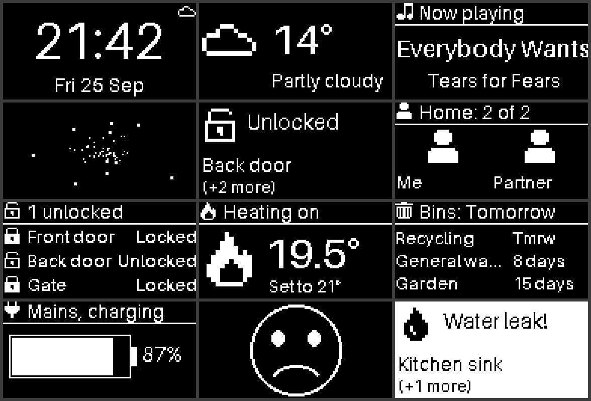

# Home Assistant setup

How my Raspberry Pi 4 home hub is built: the hardware, the Home Assistant OS
install runbook, the scripts that flash and prepare the SD card, and the
Home Assistant apps I write for it.



## What is here

| Path | What it is |
| --- | --- |
| [`docs/`](docs/readme.md) | Hardware, install runbook, what the old setup had, and the roadmap |
| [`oled_status/`](oled_status/DOCS.md) | **OLED Status**, a Home Assistant app for the case's 0.96 inch OLED: clock, weather, people, locks, heating, bins, now playing, UPS, alerts, and a starfield |
| [`ha-os/boot/`](ha-os/boot) | Boot settings for the RaspBee II serial port and I2C |
| [`scripts/`](scripts) | Back up and flash SD cards, prepare the boot partition, set up a dev machine |

## Install the apps

In Home Assistant: Settings, Apps, App store, the three-dot menu,
Repositories, then add this repository's URL:

```text
https://github.com/TGTGamer/home-assistant-setup
```

## Develop

Needs [uv](https://docs.astral.sh/uv/) and [pnpm](https://pnpm.io/).

```sh
scripts/agent-setup.sh   # or scripts/agent-setup.ps1 on Windows
pnpm preview             # render every OLED page to previews/
pnpm verify              # lint, types, tests, headers, licences
```

## Licence

[FCL-1.0-MIT](LICENSE): the Fair Core License with an MIT future grant. Each
version becomes MIT licensed on the second anniversary of its release; to use
an MIT-aged version, check out a commit at least two years old. See
[CONTRIBUTING.md](CONTRIBUTING.md) and [CODE_OF_CONDUCT.md](CODE_OF_CONDUCT.md).
